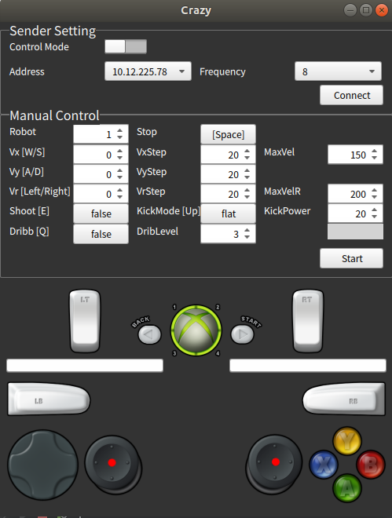

## Introduction to Crazy
* This is a robot control software on the computer for ZJUNlict (Communication Protocol V1.6 since 2018.11.06).
* This is a cross-platform software, so you can run it on Linux, Windows, macOS, iOS, Android, etc.
* You can connect a gamepad(e.g., Xbox) to it.

## Requirements
* Qt5(>5.7)
* qmake(>3,0) or cmake(>3.0)

## Installation
You can use Qt Creator to open this project and build it, or just run cmake_build.sh and build it automatically.

## How to use this Crazy with Controller
* 1. If you want to use the original crazy with keyboard, feel free to use it without switching the "Control Mode" switch on the up-left corner.
* 2. if you are ready to use the controller, switch the "Control Mode" switch and remember this by doing this, you will disable your keyboard manipulation.
* 3. Once you are in the Controller Mode, please read the followings.
* 4. The Left Joystick will enable your robot to move in X and Y direction.
* 5. The Right Joystick will enable your robot to spin.
* 6. The Right Trigger will give the robot a dribbling command and also a dribbling level according to  the force you applied.
* 7. The Left Trigger will give the Kick Power according to the force, and if you press X(or Y) at the same time, the robot will flat kick(or chip kick) the ball with the specific power .
* 8. TO BE CONTINUE........